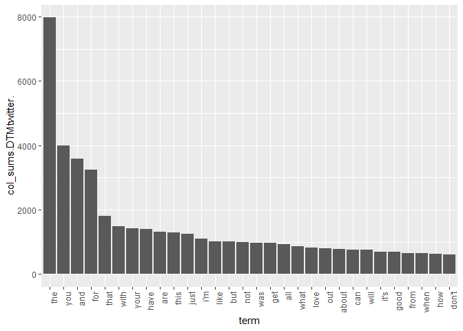
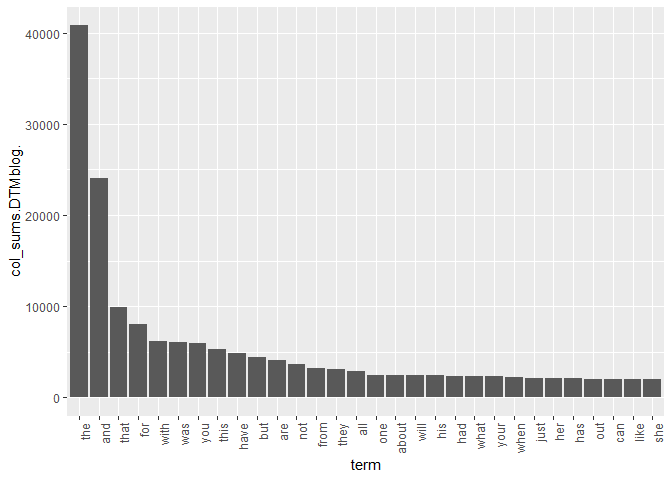
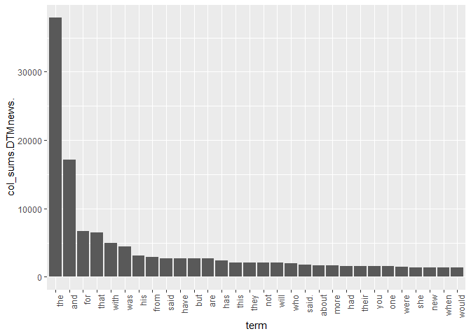
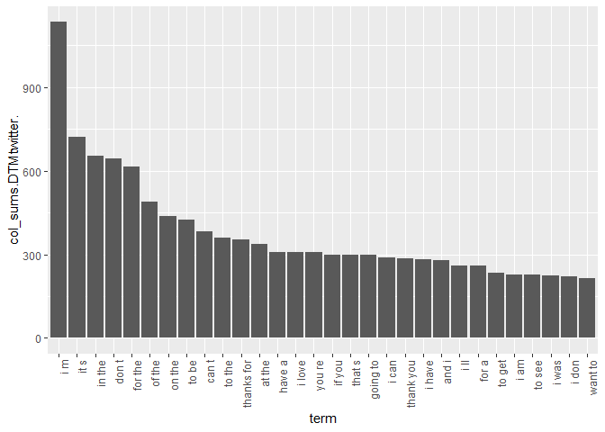
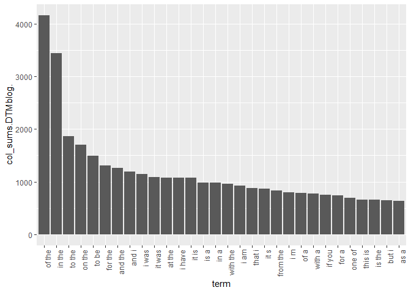
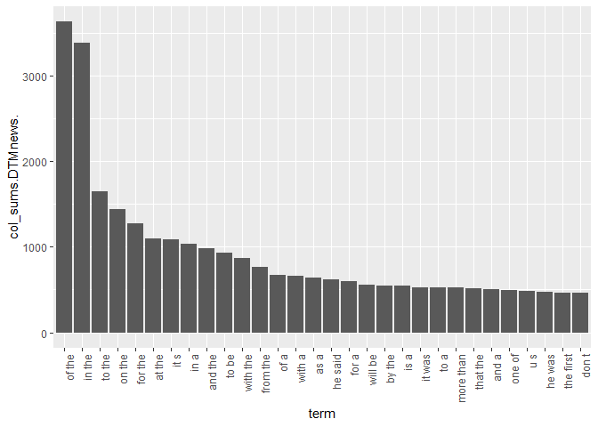
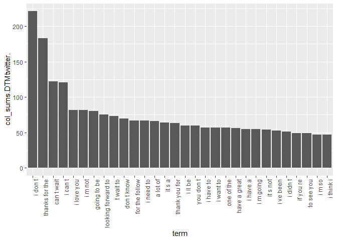
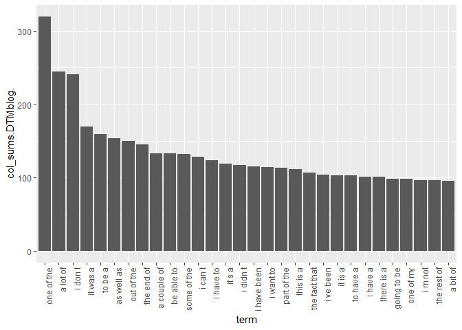
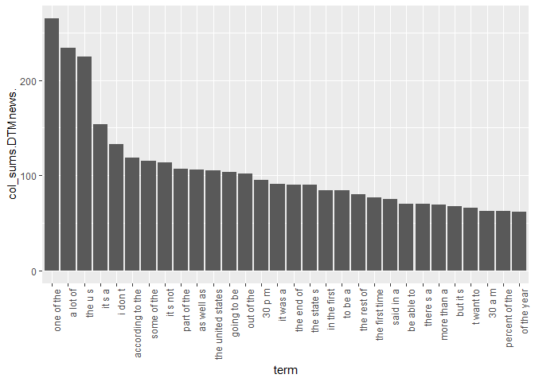

# Preface

I'm starting this milestone report without really knowing what is expected of it, because it won't be unlocked until 5/13, and today is 5/6, and honestly, who really wants to wait for a week to see what you're supposed to do next.  I'm guessing they want us to clean the data and perform some EDA, and it's a milestone so you probably need a plan for what else you'll do (and hey, the non-peer-reviewed tasks can be completed as soon as I want, so I have a good idea of what is expected of us for the final product) but if I'm wrong I'll make some corrections/additions.

# Introduction
The goal of this capstone is to create a predictive text model; that is, we will try to predict the next word in a sequence given the word (or words) preceding it.  In order to develop our predictive text model, we will be using a large corpus of twitter, blog, and news text that has been given to us from [here](https://d396qusza40orc.cloudfront.net/dsscapstone/dataset/Coursera-SwiftKey.zip).  Within this compressed folder were several files, some in different languages.  The ones we are concerned with are the english language twitter, blog, and news files:

# Analysis
## Pull in data

```r
setwd("~/JHU_DataScienceCapstone")
con <- file("Data/en_US/en_US.twitter.txt", "rb")
twitterData <- readLines(con)
close(con)
con <- file("Data/en_US/en_US.blogs.txt", "rb")
blogData <- readLines(con)
close(con)
con <- file("Data/en_US/en_US.news.txt", "rb")
newsData <- readLines(con)
close(con)
head(twitterData,2)
```

```
## [1] "How are you? Btw thanks for the RT. You gonna be in DC anytime soon? Love to see you. Been way, way too long."  
## [2] "When you meet someone special... you'll know. Your heart will beat more rapidly and you'll smile for no reason."
```

```r
head(blogData,2)
```

```
## [1] "In the years thereafter, most of the Oil fields and platforms were named after pagan â\200œgodsâ\200\235."
## [2] "We love you Mr. Brown."
```

```r
head(newsData,2)
```

```
## [1] "He wasn't home alone, apparently."                                                                                                                        
## [2] "The St. Louis plant had to close. It would die of old age. Workers had been making cars there since the onset of mass automotive production in the 1920s."
```


I had to use the binary read ("rb") setting in *file()*, because it threw an error when trying to read the bank file in normal read mode.

Interesting that the news and blog corpora are as short as they are...I wonder if they broke up entire articles/posts into paragraphs.  At any rate, let's continue with the EDA.

## Exploratory Data Analysis

I want to see the most common words without any tokenization/stemming/lemmatization/stopword-removal (sampling down because my machine can't handle all of those documents).  Let's get those words first:


```r
library(tm)
```

```
## Loading required package: NLP
```

```r
library(slam)
set.seed(5-6-2019)
twitterData <- twitterData[sample(1:length(twitterData),20000)]
blogData <- blogData[sample(1:length(blogData),20000)]
newsData <- newsData[sample(1:length(newsData),20000)]

corpusTwitter <- VCorpus(VectorSource(twitterData))
corpusBlog <- VCorpus(VectorSource(blogData))
corpusNews <- VCorpus(VectorSource(newsData))

DTMtwitter <- DocumentTermMatrix(corpusTwitter)
DTMblog <- DocumentTermMatrix(corpusBlog)
DTMnews <- DocumentTermMatrix(corpusNews)

twitterCounts <- data.frame(col_sums(DTMtwitter))
twitterCounts$term <- row.names(twitterCounts)
blogCounts <- data.frame(col_sums(DTMblog))
blogCounts$term <- row.names(blogCounts)
newsCounts <- data.frame(col_sums(DTMnews))
newsCounts$term <- row.names(newsCounts)

twitterCounts <- twitterCounts[order(twitterCounts$col_sums.DTMtwitter., decreasing = TRUE),]
blogCounts <- blogCounts[order(blogCounts$col_sums.DTMblog., decreasing = TRUE),]
newsCounts <- newsCounts[order(newsCounts$col_sums.DTMnews., decreasing = TRUE),]

twitterCounts <- twitterCounts[1:30,]
twitterCounts$term <- factor(twitterCounts$term, levels = twitterCounts$term)
blogCounts <- blogCounts[1:30,]
blogCounts$term <- factor(blogCounts$term, levels = blogCounts$term)
newsCounts <- newsCounts[1:30,]
newsCounts$term <- factor(newsCounts$term, levels = newsCounts$term)
```

And the histograms of 30 most common words:


```r
library(ggplot2)
```

```
## 
## Attaching package: 'ggplot2'
```

```
## The following object is masked from 'package:NLP':
## 
##     annotate
```

```r
print(ggplot(data = twitterCounts, aes(x=term, y=col_sums.DTMtwitter.)) + geom_bar(stat="identity") + theme(axis.text.x = element_text(angle = 90, hjust = 1)))
```

<!-- -->

```r
print(ggplot(data = blogCounts, aes(x=term, y=col_sums.DTMblog.)) + geom_bar(stat="identity") + theme(axis.text.x = element_text(angle = 90, hjust = 1)))
```

<!-- -->

```r
print(ggplot(data = newsCounts, aes(x=term, y=col_sums.DTMnews.)) + geom_bar(stat="identity") + theme(axis.text.x = element_text(angle = 90, hjust = 1)))
```

<!-- -->


The results look logical: "the", "and", "for", "that", and "with" should all appear more oftan than the others, and "you" should be much more common in tweets than in blogs, and much less common in news articles than tweets or blogs.  So separate models for (or a model that accounts for) the different sources could be better than a model that doesn't distinguish between the different texts.  Next let's clean up the corpora, and we'll look at bigrams and trigrams.

I initially was going to remove punctuation, remove numbers, lowercase everything, and lemmatize.  But I've decided against everything except for removing extra whitespace because we'll eventually want to predict what comes after numbers/punctuation as well as predict them after other words.  For instance, we don't want to predict a lemmatized word, because that often won't make sense.  We also would want to predict a capitalized word after a period.  So I'll do my bigram/trigram analysis without that pre-processing done:


```r
library(textstem)
```

```
## Loading required package: koRpus.lang.en
```

```
## Loading required package: koRpus
```

```
## Loading required package: sylly
```

```
## For information on available language packages for 'koRpus', run
## 
##   available.koRpus.lang()
## 
## and see ?install.koRpus.lang()
```

```r
#corpusTwitter <- tm_map(corpusTwitter, removePunctuation)
#corpusTwitter <- tm_map(corpusTwitter, removeNumbers)
#corpusTwitter <- tm_map(corpusTwitter, content_transformer(tolower))
#corpusTwitter <- tm_map(corpusTwitter, removeWords, stopwords("en"))
corpusTwitter <- tm_map(corpusTwitter, stripWhitespace)
#corpusTwitter <- tm_map(corpusTwitter, content_transformer(lemmatize_words))

#corpusBlog <- tm_map(corpusBlog, removePunctuation)
#corpusBlog <- tm_map(corpusBlog, removeNumbers)
#corpusBlog <- tm_map(corpusBlog, content_transformer(tolower))
#corpusBlog <- tm_map(corpusBlog, removeWords, stopwords("en"))
corpusBlog <- tm_map(corpusBlog, stripWhitespace)
#corpusBlog <- tm_map(corpusBlog, content_transformer(lemmatize_words))

#corpusNews <- tm_map(corpusNews, removePunctuation)
#corpusNews <- tm_map(corpusNews, removeNumbers)
#corpusNews <- tm_map(corpusNews, content_transformer(tolower))
#corpusNews <- tm_map(corpusNews, removeWords, stopwords("en"))
corpusNews <- tm_map(corpusNews, stripWhitespace)
#corpusNews <- tm_map(corpusNews, content_transformer(lemmatize_words))
```

Now let's look at the bi- and trigrams after cleaning (I don't expect the top unigrams to change much since the top 30 in each document class were lower case and didn't have punctuation.  I grabbed the *BigramTokenizer()* and *TrigramTokenizer()* function ideas from someone on stackoverflow:


```r
library("RWeka")

BigramTokenizer <- function(x) NGramTokenizer(x, Weka_control(min = 2, max = 2))
TrigramTokenizer <- function(x) NGramTokenizer(x, Weka_control(min = 3, max = 3))

DTMtwitter <- DocumentTermMatrix(corpusTwitter, control=list(tokenize=BigramTokenizer))
DTMblog <- DocumentTermMatrix(corpusBlog, control=list(tokenize=BigramTokenizer))
DTMnews <- DocumentTermMatrix(corpusNews, control=list(tokenize=BigramTokenizer))

twitterCounts <- data.frame(col_sums(DTMtwitter))
twitterCounts$term <- row.names(twitterCounts)
blogCounts <- data.frame(col_sums(DTMblog))
blogCounts$term <- row.names(blogCounts)
newsCounts <- data.frame(col_sums(DTMnews))
newsCounts$term <- row.names(newsCounts)

twitterCounts <- twitterCounts[order(twitterCounts$col_sums.DTMtwitter., decreasing = TRUE),]
blogCounts <- blogCounts[order(blogCounts$col_sums.DTMblog., decreasing = TRUE),]
newsCounts <- newsCounts[order(newsCounts$col_sums.DTMnews., decreasing = TRUE),]

twitterCounts <- twitterCounts[1:30,]
twitterCounts$term <- factor(twitterCounts$term, levels = twitterCounts$term)
blogCounts <- blogCounts[1:30,]
blogCounts$term <- factor(blogCounts$term, levels = blogCounts$term)
newsCounts <- newsCounts[1:30,]
newsCounts$term <- factor(newsCounts$term, levels = newsCounts$term)

print(ggplot(data = twitterCounts, aes(x=term, y=col_sums.DTMtwitter.)) + geom_bar(stat="identity") + theme(axis.text.x = element_text(angle = 90, hjust = 1)))
```

<!-- -->

```r
print(ggplot(data = blogCounts, aes(x=term, y=col_sums.DTMblog.)) + geom_bar(stat="identity") + theme(axis.text.x = element_text(angle = 90, hjust = 1)))
```

<!-- -->

```r
print(ggplot(data = newsCounts, aes(x=term, y=col_sums.DTMnews.)) + geom_bar(stat="identity") + theme(axis.text.x = element_text(angle = 90, hjust = 1)))
```

<!-- -->

```r
DTMtwitter <- DocumentTermMatrix(corpusTwitter, control=list(tokenize=TrigramTokenizer))
DTMblog <- DocumentTermMatrix(corpusBlog, control=list(tokenize=TrigramTokenizer))
DTMnews <- DocumentTermMatrix(corpusNews, control=list(tokenize=TrigramTokenizer))

twitterCounts <- data.frame(col_sums(DTMtwitter))
twitterCounts$term <- row.names(twitterCounts)
blogCounts <- data.frame(col_sums(DTMblog))
blogCounts$term <- row.names(blogCounts)
newsCounts <- data.frame(col_sums(DTMnews))
newsCounts$term <- row.names(newsCounts)

twitterCounts <- twitterCounts[order(twitterCounts$col_sums.DTMtwitter., decreasing = TRUE),]
blogCounts <- blogCounts[order(blogCounts$col_sums.DTMblog., decreasing = TRUE),]
newsCounts <- newsCounts[order(newsCounts$col_sums.DTMnews., decreasing = TRUE),]

twitterCounts <- twitterCounts[1:30,]
twitterCounts$term <- factor(twitterCounts$term, levels = twitterCounts$term)
blogCounts <- blogCounts[1:30,]
blogCounts$term <- factor(blogCounts$term, levels = blogCounts$term)
newsCounts <- newsCounts[1:30,]
newsCounts$term <- factor(newsCounts$term, levels = newsCounts$term)

print(ggplot(data = twitterCounts, aes(x=term, y=col_sums.DTMtwitter.)) + geom_bar(stat="identity") + theme(axis.text.x = element_text(angle = 90, hjust = 1)))
```

<!-- -->

```r
print(ggplot(data = blogCounts, aes(x=term, y=col_sums.DTMblog.)) + geom_bar(stat="identity") + theme(axis.text.x = element_text(angle = 90, hjust = 1)))
```

<!-- -->

```r
print(ggplot(data = newsCounts, aes(x=term, y=col_sums.DTMnews.)) + geom_bar(stat="identity") + theme(axis.text.x = element_text(angle = 90, hjust = 1)))
```

<!-- -->

Interesting.  I didn't remove punctuation, so the contractions being split into two words ("don't" is now "don t") in twitter is an artifact of the text.  I think this is even more of a sign that we need to account for the different text sources; that is, I'm going to assume that someone who wants auto-predict in twitter would like me to predict "don t" sometimes.  And while the contractions difference above isn't saving any characters, twitter posts are limited to character counts, so of course they'll have different writing styles!

## Next steps
The end goal for this capstone (based on what I've gathered from watching future weeks' videos and readings) is to develop a prediction model to predict the next word in a sequence of text, deploy it to shiny, and also develop a small slidify presentation to pitch it.  My goal is to implemnt a backoff model since I've never done that before, but I'll try some other things along the way, and maybe that's what will make it into the final model.  Ultimately, I've also got to consider the processing limitations of the free shiny server I'll be using (who knows, maybe I'll stand up my own server to host it there!).
